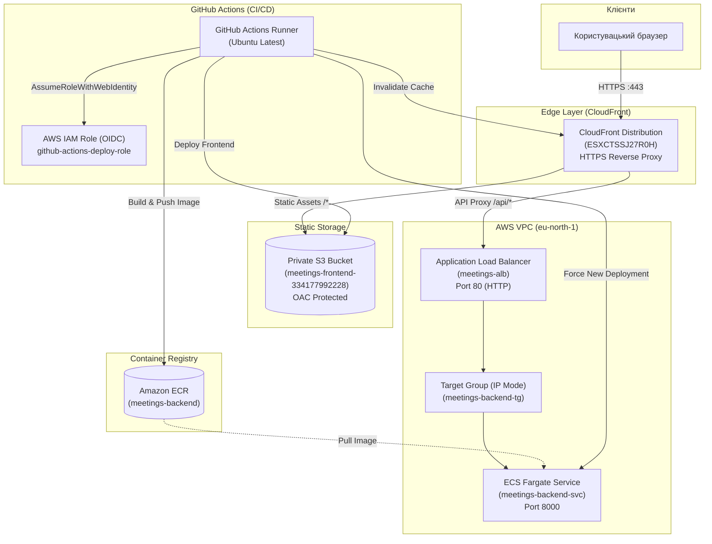

# Meetings App — CI/CD та AWS Cloud Deployment

Звіт та технічна документація про виконання лабораторної роботи з налаштування CI/CD пайплайнів, інфраструктури як коду та автоматизованого деплою в хмару AWS.

---

## 1. Огляд проєкту та архітектура

**Meetings App** — веб-застосунок для планування зустрічей, календарного огляду та управління учасниками.

### Архітектура застосунку:
- **Frontend**: Single Page Application (SPA) на **React 19 + TypeScript + Vite + Tailwind CSS + shadcn/ui**.
- **Backend**: RESTful API на **Python 3.12 + FastAPI + SQLAlchemy 2 + Pydantic v2**.
- **Cloud Infrastructure**: AWS Cloud (Serverless SPA hosting на S3/CloudFront + контейнеризований бекенд на ECS Fargate за ALB).



---

## 2. Деплой та живі посилання

| Сервіс / Ендпоінт | Посилання | Опис |
|---|---|---|
| 🌐 **Frontend & Reverse Proxy** | [https://d1y19dbl226ufk.cloudfront.net](https://d1y19dbl226ufk.cloudfront.net) | Головний публічний HTTPS-ендпоінт сайту |
| 🩺 **Backend Health Check** | [https://d1y19dbl226ufk.cloudfront.net/api/health](https://d1y19dbl226ufk.cloudfront.net/api/health) | Перевірка працездатності API через CloudFront |
| ⚙️ **Application Load Balancer** | [http://meetings-alb-1279017703.eu-north-1.elb.amazonaws.com](http://meetings-alb-1279017703.eu-north-1.elb.amazonaws.com) | Прямий DNS-хост балансувальника (HTTP) |
| 🌍 **AWS Region** | `eu-north-1` (Стокгольм) | Основний робочий регіон інфраструктури |

---

## 3. Інфраструктура (AWS)

Уся інфраструктура розгорнута в регіоні `eu-north-1` з оптимізацією за вартістю (найдешевші Fargate ліміти) та дотриманням найкращих практик безпеки:

### 3.1. S3 & CloudFront (Frontend + API Gateway)
- **S3 Bucket**: `meetings-frontend-334177992228`
  - Повністю приватний бакет із увімкненим `BlockPublicAcls`, `BlockPublicPolicy`, `IgnorePublicAcls`, `RestrictPublicBuckets`.
  - Доступ дозволений **виключно** сервісу CloudFront через **Origin Access Control (OAC)** `EBKS684BNRNS9`.
- **CloudFront Distribution**: `ESXCTSSJ27R0H`
  - **Origin 1 (S3Origin)**: роздача зібраного SPA (файли `index.html`, `assets/*`).
  - **Origin 2 (ALBOrigin)**: підключення Application Load Balancer (`meetings-alb-1279017703.eu-north-1.elb.amazonaws.com`) по протоколу HTTP на порт 80.
  - **Cache Behavior `/api/*`**: перенаправляє всі API-запити на ALB, дозволяючи всі HTTP-методи (`GET, HEAD, OPTIONS, PUT, POST, PATCH, DELETE`) та прокидаючи всі заголовки (включно з `Authorization`), куки та query-параметри без кешування (`TTL = 0`).
  - **Вирішення Mixed Content & CORS**: завдяки роутингу `/api/*` браузер надсилає запити до бекенду за тією ж HTTPS-адресою, що й завантажує сторінку (`https://d1y19dbl226ufk.cloudfront.net/api/...`). Це повністю усуває блокування Mixed Content (HTTPS -> HTTP) та необхідність складних CORS-налаштувань.

### 3.2. ECR & Контейнеризація
- **ECR Repository**: `meetings-backend`
  - URI: `334177992228.dkr.ecr.eu-north-1.amazonaws.com/meetings-backend`
  - Image Scanning on Push увімкнено.
  - Образи тегуються коротким/повним Git SHA комміту та тегом `latest`.

### 3.3. Обчислювальні ресурси та мережа (ECS Fargate + ALB)
- **VPC**: Default VPC `vpc-06a44a341230eac1f` з публічними підмережами у двох зонах доступності (`eu-north-1a`, `eu-north-1b`, `eu-north-1c`).
- **Security Groups**:
  - **ALB Security Group** (`sg-06257b3ed60d576f7`): відкритий тільки вхідний трафік на порт 80 (HTTP) з будь-яких IP (`0.0.0.0/0`).
  - **ECS Security Group** (`sg-03ae0158551fe30b0`): вхідний трафік на порт 8000 дозволений **тільки** від Security Group балансувальника (`sg-06257b3ed60d576f7`). Прямий доступ з інтернету до таски заблокований.
- **Application Load Balancer**: `meetings-alb`
  - Listener: HTTP :80 з перенаправленням на Target Group.
  - **Target Group**: `meetings-backend-tg` (тип `ip`), Health Check шлях `/api/health` з інтервалом 30 с.
- **ECS Cluster & Service**:
  - Кластер: `meetings-cluster`.
  - Сервіс: `meetings-backend-svc` (Launch type: `FARGATE`, Desired count: 1).
  - Task Definition: `meetings-backend-task:1` з мінімальними ресурсами — **0.25 vCPU (256 CPU units)** та **0.5 GB RAM (512 MiB)**.
  - IAM Execution Role: `meetings-ecs-execution-role` з політикою `AmazonECSTaskExecutionRolePolicy`.
  - Логування: CloudWatch Log Group `/ecs/meetings-backend`.

---

## 4. CI/CD та безпека (GitHub Actions)

Всі процеси інтеграції та доставки повністю автоматизовані за допомогою двох GitHub Actions workflows:

### 4.1. Linting & Code Style ([`.github/workflows/lint.yml`](.github/workflows/lint.yml))
Запускається при кожному `push` та `pull_request` у гілку `main`:
- **Backend (Python)**:
  - Встановлення Python 3.12 через `astral-sh/setup-uv@v6` з кешуванням залежностей.
  - `uv run ruff check --output-format=github .` — статичний аналіз коду (правила `E, W, F, I, B, UP, SIM, C4`).
  - `uv run ruff format --check --diff .` — перевірка відповідності форматування стилю коду.
- **Frontend (TypeScript/React)**:
  - Встановлення Node.js 24 через `actions/setup-node@v4` з кешуванням `npm`.
  - `npm ci --no-audit --no-fund` — детерміноване встановлення залежностей.
  - `npm run lint` — перевірка лінтером ESLint (flat config).
  - `npm run format:check` — валідація форматування Prettier.

### 4.2. Контракт деплою ([`Makefile`](Makefile))
`Makefile` у корені проєкту стандартизує всі ручні та автоматичні кроки розгортання:
- `make deploy-frontend`: збирає фронтенд (`npm run build`), синхронізує бандл `front/dist` з S3 (`aws s3 sync`) та виконує інвалідацію кешу CloudFront.
- `make deploy-backend`: логіниться в Amazon ECR, збирає Docker-образ з `back/Dockerfile`, пушить в ECR з тегом поточного Git SHA та оновлює ECS-сервіс через `aws ecs update-service --force-new-deployment`.
- `make status`: виводить актуальні ідентифікатори та URL створеної інфраструктури.

### 4.3. Безпека через OIDC (Zero Long-Lived Credentials)
Замість збереження довгоживучих AWS Access Key ID та Secret Access Key у GitHub Secrets налаштовано автентифікацію через **OpenID Connect (OIDC)**:
- **IAM Identity Provider**: `arn:aws:iam::334177992228:oidc-provider/token.actions.githubusercontent.com`
- **IAM Deploy Role**: `arn:aws:iam::334177992228:role/github-actions-deploy-role`
- **Trust Policy**: суворо обмежено репозиторієм через `StringLike` (із врахуванням формату суб'єкта GitHub Actions):
  ```json
  {
    "Version": "2012-10-17",
    "Statement": [
      {
        "Effect": "Allow",
        "Principal": {
          "Federated": "arn:aws:iam::334177992228:oidc-provider/token.actions.githubusercontent.com"
        },
        "Action": "sts:AssumeRoleWithWebIdentity",
        "Condition": {
          "StringEquals": {
            "token.actions.githubusercontent.com:aud": "sts.amazonaws.com"
          },
          "StringLike": {
            "token.actions.githubusercontent.com:sub": [
              "repo:2surfff*OneTwoThree*:*",
              "repo:2surfff/OneTwoThree:*"
            ]
          }
        }
      }
    ]
  }
  ```
- **Permissions Policy**: надає мінімально необхідні права (Least Privilege):
  - `s3:PutObject`, `s3:GetObject`, `s3:ListBucket`, `s3:DeleteObject` до бакета `meetings-frontend-334177992228`.
  - `cloudfront:CreateInvalidation` для дистрибуції `ESXCTSSJ27R0H`.
  - `ecr:GetAuthorizationToken`, `ecr:PutImage`, `ecr:InitiateLayerUpload` тощо до репозиторію `meetings-backend`.
  - `ecs:UpdateService`, `ecs:Describe*` до кластера `meetings-cluster` та сервісу `meetings-backend-svc`.
  - `iam:PassRole` для execution ролі `meetings-ecs-execution-role`.

### 4.4. Автоматичний CD пайплайн ([`.github/workflows/deploy.yml`](.github/workflows/deploy.yml))
Спрацьовує автоматично при пуші в гілку `main`. Виконує дві паралельні задачі:
1. **Frontend Job**:
   - Чек-аут репозиторію та інсталяція Node.js 24.
   - Збірка клієнта з відносним шляхом `VITE_API_URL=""` (same origin).
   - OIDC автентифікація через `aws-actions/configure-aws-credentials@v4`.
   - Завантаження артефактів збірки в S3 бакет.
   - Інвалідація кешу CloudFront для оновлення сторінок у користувачів.
2. **Backend Job**:
   - Чек-аут коду.
   - OIDC автентифікація через `aws-actions/configure-aws-credentials@v4`.
   - Авторизація в ECR за допомогою `aws-actions/amazon-ecr-login@v2`.
   - Збірка Docker-образу бекенду.
   - Пуш образу з тегами `${{ github.sha }}` та `latest`.
   - Оновлення ECS Fargate сервісу (`aws ecs update-service --force-new-deployment`).

---

## 5. Інструкції щодо локального запуску та перевірок

### 5.1. Попередні вимоги
- Python 3.12+ та пакетний менеджер `uv`
- Node.js 20+ (рекомендовано Node.js 24) та `npm`
- Docker (опціонально для контейнерного запуску)

### 5.2. Локальний запуск бекенду
```bash
cd back

# 1. Створення venv та встановлення залежностей
uv sync

# 2. Запуск сервера розробки
uv run uvicorn app.main:app --reload --port 8000
```
API документація Swagger UI доступна за адресою: [http://localhost:8000/api/docs](http://localhost:8000/api/docs)

### 5.3. Локальний запуск фронтенду
```bash
cd front

# 1. Встановлення залежностей
npm install

# 2. Запуск Vite dev-сервера
npm run dev
```
Фронтенд буде доступний за адресою: [http://localhost:5173](http://localhost:5173) (Vite автоматично проксує `/api` на локальний бекенд).

### 5.4. Запуск лінтерів локально

#### Бекенд (Ruff):
```bash
cd back

# Перевірка правил стилю коду
uv run ruff check .

# Автоматичне виправлення помилок
uv run ruff check --fix .

# Перевірка форматування
uv run ruff format --check .

# Автоматичне форматування
uv run ruff format .
```

#### Фронтенд (ESLint, Prettier, TypeScript):
```bash
cd front

# Запуск ESLint
npm run lint

# Перевірка форматування Prettier
npm run format:check

# Автоматичне форматування Prettier
npm run format

# Перевірка типізації TypeScript
npm run typecheck
```

---

## 6. Висновок

Усі вимоги лабораторної роботи виконано у повному обсязі:
1. Досліджено структуру проєкту та налаштовано строгий контроль коду через **Ruff**, **ESLint** та **Prettier**.
2. Створено GitHub Actions CI пайплайн `lint.yml` та перевірено поведінку на навмисній помилці (червоний білд).
3. Сформовано єдиний контракт деплою у вигляді `Makefile`.
4. Розгорнуто сучасну хмарну інфраструктуру в **AWS (eu-north-1)** на базі S3, CloudFront (OAC + Reverse Proxy), ALB, Security Groups та ECS Fargate.
5. Забезпечено найвищий рівень безпеки за допомогою **GitHub Actions OIDC** автентифікації без збереження статичних AWS ключів.
6. Налаштовано повноцінний CD пайплайн `deploy.yml`, що автоматично синхронізує код та оновлює сервіси в хмарі.
